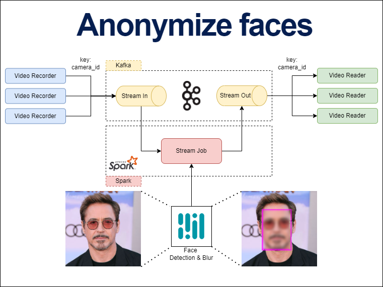

# Anonymize faces in video stream
[YouTobe (RU)](https://youtu.be/WpgRkRELP5I)

## System Design

## Results

## Structure
### Requirements
Install to your venv `pip install requirements.txt`

Frameworks: OpenCV, Spark, Kafka, Pandas, PyArrow

### Video Recorder
App for record video to Kafka as stream.

Run `python app/video_recorder.py`

### Video Reader
App for read video from Kafka as stream. 

Run `python app/video_reader.py`

### Video Stream Job
PySpark stream job to process frames, detect face and blur. 

Base on MediaPipe [face detection model](https://google.github.io/mediapipe/solutions/face_detection.html).

Run `spark-submit app/video_stream_job.py` or `python app/video_stream_job.py`

## Reproduce
- Up Kafka Brokers `docker-compose up -d`
- Create kafka topics (make sure set max.message.bytes property with value=1246000 or more):
  - VideoStream-in: `kafka-topics --create --topic videostream_in --partitions 3 --bootstrap-server localhost:9092,localhost:9093,localhost:9094 --config max.message.bytes=1246000`
  - VideoStream-out: `kafka-topics --create --topic videostream_out --partitions 3 --bootstrap-server localhost:9092,localhost:9093,localhost:9094 --config max.message.bytes=1246000`
- Submit Video Stream Job `spark-submit --py-files app/utils.py,app/face_detector.py app/video_stream_job.py`
- Run `python app/video_reader.py`
- Run `python app/video_recorder.py`
